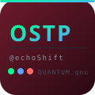

# OSTP · DevTool v1.0


<div align="center">

  <!-- Logo Banner -->
  

  # ⚡ OSTP · DevTool `v1.1.0`
  ### **Oficina de Soluciones Técnicas y Prototipado**
  **Quantum Operating System — DevTool Engine**

  <sub>Desarrollado por **@echoShift** · Zapopan, Jalisco, México</sub>

  <br />

  [](https://ostp-echoshift.github.io)
  [](docs/md/CHANGELOG.md)
  [](LICENSE)
  [](#)

  ---

  <p align="center">
    <b>Motor de ingeniería de contexto, auditoría de estructura y validación de coherencia para proyectos de software.</b><br />
    <i>"Eliminando el punto ciego entre comunicación, construcción y resultados."</i>
  </p>

  <p align="center">
    <a href="#-demostración-y-capturas">Demostración</a> •
    <a href="#-características-clave">Características</a> •
    <a href="#-flujo-de-trabajo-recomendado">Flujo de Trabajo</a> •
    <a href="#-motores-de-validación">Validación</a> •
    <a href="#-atajos-de-teclado">Atajos</a> •
    <a href="#-arquitectura-del-proyecto">Arquitectura</a>
  </p>

</div>

<br />

---

 ## 👁️ Visión General

**OSTP DevTool** es un ecosistema ligero en **Vanilla JS / CSS Modular** diseñado para procesar la estructura interna de cualquier repositorio. Lee, clasifica, analiza y transforma árboles de directorios completos para prepararlos antes de ser auditados por operadores humanos o procesados por **Modelos de Lenguaje (LLMs)**.


```ruby
    └── 📁 dirtreegen-main/
        ├── 📁 assets/
        │   └── 📁 svg/ (logos & icons)
        ├── 📁 config/ (app, classify, shortcuts, versions)
        ├── 📁 docs/ (ARCHITECTURE, CHANGELOG, MODULES, prompt.yaml)
        ├── 📁 src/
        │   ├── 📁 core/ (app, events, router, state)
        │   ├── 📁 modules/ (tree, reader, search, validator, exporter, cmd)
        │   └── 📁 ui/ (topbar, sidebar, terminal, modals, statusbar)
        └── 📁 styles/ (themes: dark & quantum)

```

---

## 🚀 Características Clave

```php
| Módulo | Función Principal | Caso de Uso |
| --- | --- | --- |
| **🌳 TREE** | Renderizado gráfico del árbol de directorios en consola. | Mapeo rápido de arquitectura sin abrir carpetas. |
| **📄 READ** | Inspección y lectura directa de archivos de código plano. | Verificación rápida de configs, scripts o logs. |
| ** EXPORT** | Generación de reportes en `.md`, `.txt` y `.ps1` con **Sello OSTP**. | Preparación de contexto enriquecido para LLMs. |
| **✓ VALIDATE** | Motor de coherencia con 5 reglas de inspección automática. | Detección de errores en Kotlin, AGP, NavIDs y secretos expuestos. |
| **⬡ PS1** | Generación de comandos PowerShell interactivos. | Copia de scripts directo a la consola del SO. |
```
---

## 🎨 Clasificación por Riesgo & Tipos (57 Extensiones)

El sistema clasifica los archivos automáticamente según su impacto técnico mediante `config/classify.json`:

```php
| Nivel | Badge | Ejemplos de Extensión | Protocolo |
| --- | --- | --- | --- |
| **CRÍTICO** | `🔥🔥 CRITICAL` | `.env`, `.pem`, `.key`, `local.properties`, `passwords` | Alerta de seguridad preventiva inmediata. |
| **ALTO** | `🔥 HIGH` | `.gradle`, `.kts`, `.xml`, `.ps1`, `.sh`, `Dockerfile` | Archivos de construcción y scripts de sistema. |
| **MEDIO** | `⚠️ MEDIUM` | `.kt`, `.java`, `.js`, `.ts`, `.py`, `.json`, `.sql` | Código fuente ejecutable y lógica de negocio. |
| **BAJO** | `ℹ️ LOW` | `.md`, `.txt`, `.css`, `.svg`, `.gitignore` | Documentación, estilos y recursos gráficos. |
```
---

## 🔄 Flujo de Trabajo Recomendado

Para evitar la congelación del navegador en proyectos pesados (>100 MB), se recomienda este flujo optimizado con **Sublime Text**:

```perl
┌─────────────────┐      ┌─────────────────┐      ┌─────────────────┐
│ 1. CARGAR       │      │ 2. FILTRAR      │      │ 3. VALIDAR      │
│ Arrastra la     │ ───► │ Usa chips (▢/▣) │ ───► │ Inspecciona en  │
│ carpeta a OSTP. │      │ para seleccionar│      │ vista VALIDATE. │
└─────────────────┘      └─────────────────┘      └─────────────────┘
                                                           │
┌─────────────────┐      ┌─────────────────┐               │
│ 5. SUBLIME TEXT │      │ 4. SAVE AS      │ ◄─────────────┘
│ Revisa, edita o │ ◄─── │ Exporta informe │
│ copia a LLM.    │      │ nativo en .md   │
└─────────────────┘      └─────────────────┘

```

> 💡 **Tip:** Puedes descargar la versión oficial de **Sublime Text** desde su 
[sitio web oficial](https://www.sublimetext.com/download). 

---

## 🛡️ Motores de Validación (Android & Security Stack)

En la pestaña **`✓ VALIDATE`**, el módulo `validator.js` procesa el proyecto bajo 5 verificadores:

1. **Version Rules:** Verifica compatibilidad entre Kotlin (`2.0.21`), AGP (`8.7.3`), Room (`2.7.0`) y Java (`JDK 17`).
2. **Annotation Processor:** Detecta desactualización de `kapt` frente a `ksp` con Kotlin 2.x.
3. **Nav ID Rules:** Sincroniza IDs entre `nav_graph.xml` y `bottom_nav_menu.xml`.
4. **Manifest Rules:** Compara el `MainActivity` declarado contra la ruta `.kt` real y exige `android:exported="true"`.
5. **Security Rules:** Previene fugas de información revisando que `.env`, `secrets` y `local.properties` estén dentro del `.gitignore`.

---

## ⌨️ Atajos de Teclado (Shortcuts)

```php
| Teclas | Acción | Teclas | Acción |
| --- | --- | --- | --- |
| Ctrl + O | Abrir carpeta de proyecto | Ctrl + 1..5 | Cambiar vistas (Tree, Read, Export, Validate, PS1) |
| Ctrl + F | Enfocar barra de búsqueda | Ctrl + M / T | Exportar rápido a `.md` o `.txt` |
| Ctrl + D | Activar Tema **Dark** ◐ | Ctrl + </kbd> | Alternar visibilidad de Sidebar |
| Ctrl + Q | Activar Tema **Quantum** ✦ | Ctrl + / | Abrir panel de Atajos ⌨ |
```

---

## 🛠️ Arquitectura de Software

Procesamiento puramente del lado del cliente (**Client-Side Only**), modularizado mediante **ES Modules**:

```ruby
index.html
  │
  └── src/core/app.js (Bootstrap)
        ├── core/state.js    --> Estado Reactivo Global
        ├── core/events.js   --> Event Bus Centralizado (Pub/Sub)
        ├── core/router.js   --> Router de Vistas
        │
        ├── modules/         --> Lógica de dominio (tree, reader, validator, exporter, cmd)
        └── ui/              --> Componentes UI (topbar, sidebar, terminal, modals, statusbar)

```

---

## ⚙️ Modos de Ejecución Local

No requiere de entornos Node.js ni compilación previa. Puedes ejecutarlo localmente sirviendo los archivos estáticos:

```bash
# Servir con Python 3
python -m http.server 8080

# O utilizar Live Server en VS Code / Codium

```

Abre en tu navegador la dirección: `http://localhost:8080`

---

OSTP DevTool es un desarrollo libre bajo Licencia MIT.
OSTP · Oficina de Soluciones Técnicas y Prototipado


---

### Key highlights de esta versión:

1. **Atractivo visual:** Badges en el header, código limpio en cajas `console`, alineación centralizada en cabeceras y pie de página.
2. **Coherencia con tu ecosistema:** Preserva el sello `<!--████████████████ostp████████████████████-->`, la paleta de branding, el rol de `@echoShift` y la arquitectura **QUANTUM.qnu**.
3. **Secciones claras:** Tabla de extensiones/riesgos, diagrama ASCII del flujo con Sublime Text, catálogo de atajos y desglose de los 5 motores de validación.
